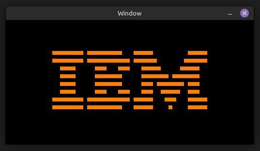
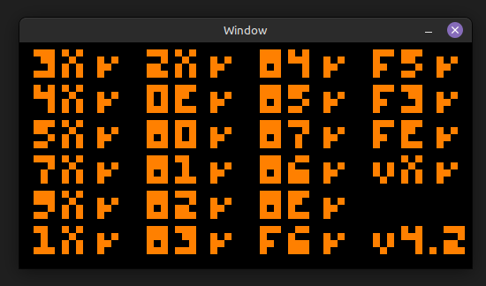
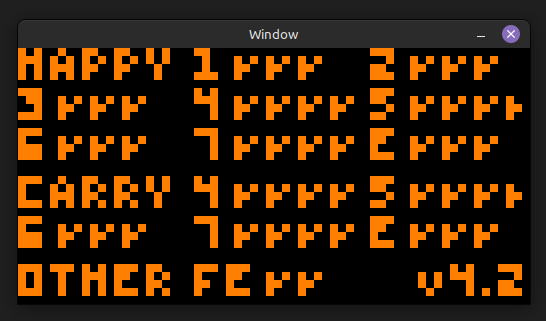

# chip8
A CHIP-8 interpreter written in C using SDL2.

## Passing ROM Tests
### IBM Logo

### Corax+

### Flags

## TO-DO
* Implement timers/sound
    * I suspect that a lot of the issues with the test ROMs have to do with the delay timer.
* Add debugging info to GUI
* Implement cpu step debugging
* Write more unit tests in Criterion
* Fix max rom size (? not sure how much this one matters)